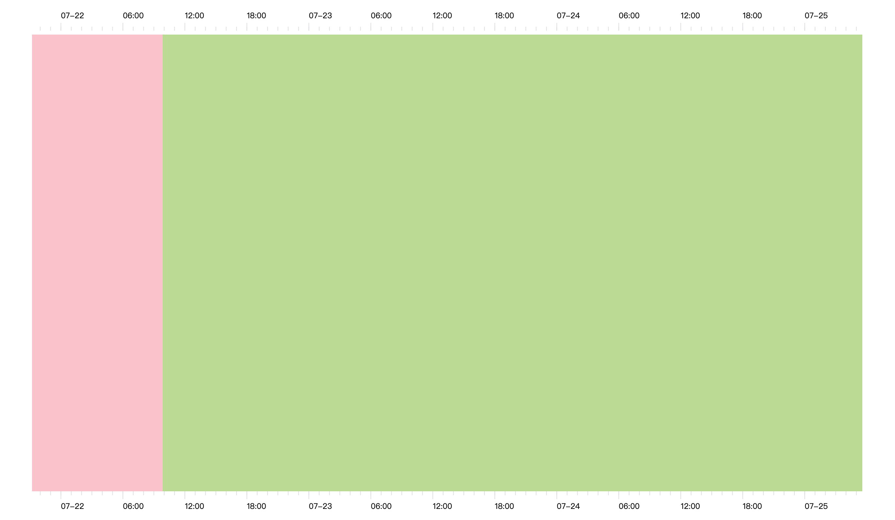

# graph-timeline

## TODO

- 缩放边界计算优化
- chart 区域渲染重构
- useVirtualSortableTreeList 实现

## 结构设计



### 画布坐标简介

- 浅绿色区域是热力泳道图和时间线的呈现画布。绿色左上角[0,0]，横向 x 轴，纵向 y 轴 。缩放拖拽的视角交互也是这个区域。<font color="red">验证目前数据结构 OK 后未来需要用 Canvas 实现渲染重构 </font>
- 粉红色 + 浅绿色底部区域（被浅绿色遮住）是 y 轴，需要实现 y 轴滚动和拖拽排序功能，包括背景线等内容都在 y 轴。目前使用 antd Tree 组件的虚拟滚动实现，<font color="red">未来需要自定义实现 useVirtualSortableTreeList 来重构</font>
- 上下 x 轴是基于 d3-axis 实现，上下两个 svg，未来也暂无重构计划

### 交互

- 浅绿色区域缩放和拖拽后，当前可视区域，上下 x 轴，y 轴呈现内容均变化。
- y 轴上下滚动时：如果是热力泳道图，则根据新的可视区域内容重绘制；因为时间线是纵向原因，如果是时间线图，则通过和 y 轴一直的 translateY 实现。

## Install dependencies

```bash
$ npm i
```

Start the dev server,

```bash
$ npm start
```

Build documentation,

```bash
$ npm run docs:build
```

Run test,

```bash
$ npm test
```

Build library via `father`,

```bash
$ npm run build
```
